# Lab 11 Stream Data Pipeline III - Spark

Install and use Apache Spark with Docker on an AWS EC2 instance.
- Use the `carpark_system.csv` file created in Lab 8.

Create Apache Spark without a cluster, then with a cluster, and compare the difference.

Create a new Jupyter notebook file named `stream_data_pipeline_3_spark.ipynb`.

<!-- ```python
import os
home_directory = os.path.expanduser("~")
os.chdir(os.path.join(home_directory, 'Documents', 'projects', 'ee3801'))
``` -->

# 1. Spark without clusters

## 1.1 Install Spark

1. SSH into the EC2 instance.

    ```bash
    # for MacOS
    ssh -i "MyKeyPair.pem" ec2-user@<ip_address>
    # for Windows
    ssh -i "~/MyKeyPair.pem" ec2-user@<ip_address>
    ```

2. Create the Spark directories.

    ```bash
    mkdir -p ~/dev_spark/work-dir
    cd ~/dev_spark
    ```

3. Pull the Spark Docker image and run the Spark container.

    ```bash
    sudo service docker start
    # stop all containers
    docker stop $(docker ps -q)
    # pull Spark docker image
    docker pull spark
    # run the docker container
    docker run --name dev_pyspark -it -v ~/dev_spark/work-dir:/opt/spark/work-dir -p 8888:8888 -p 8090:8080 -p 4040:4040 spark:latest /opt/spark/bin/pyspark
    ```

    Then exit the container:

    ```bash
    exit()
    ```

4. Pull and run the Jupyter Spark notebook container.

    ```bash
    # pull Jupyter Spark image
    docker pull jupyter/pyspark-notebook
    # run the docker container
    docker run --name dev_jupyter_pyspark -d -v ~/dev_spark/work-dir:/home/jovyan/work -p 8889:8888 -p 8091:8080 -p 4041:4040 -p 4042:4041 jupyter/pyspark-notebook:latest
    ```

5. To access Jupyter from a browser, add this inbound EC2 security group rule:

    ```text
    Type: Custom TCP
    Port Range: 8889
    Source: Anywhere-IPv4
    ```

## 1.2 Introduction to Spark

1. Access jupyter spark notebook. Go to docker container dashboard dev_jupyter_pyspark's ```Logs```. 

    - In the EC2 instance, enter:
    ```bash
    docker logs dev_jupyter_pyspark
    ```

    - Copy the link ```http://127.0.0.1:8888/lab?token=************```.

    - Paste in the browser 
        - replace ```127.0.0.1``` with the AWS EC2 instance public ip address <ip_address> 
        - replace port 8888 with port 8889.

            e.g. ```http://ec2-xxx-xxx-xxx-xx.ap-southeast-1.compute.amazonaws.com:8889/lab?token==************.```
        - if you cannot locate the token, you can run the following to retrieve the token:
            ```bash
            docker exec -it dev_jupyter_pyspark /bin/bash
            jupyter server list
            ```
        - remember to ```exit``` when you are done.

2. In the browser with Spark, access the work folder.

3. In the browser with Spark, create a jupyter notebook file using Python3 (ipykernel) in Notebook. 

    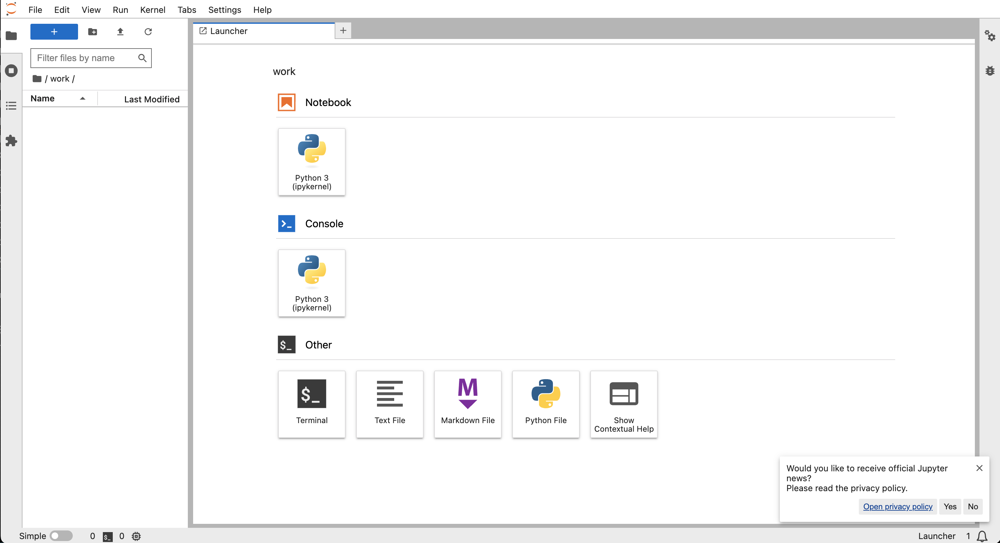

4. In the browser with Spark, upload or drag & drop `data/carpark_system.csv` to jupyter spark. Rename your Untitled.ipynb file as `stream_data_pipeline_3_spark.ipynb`.

    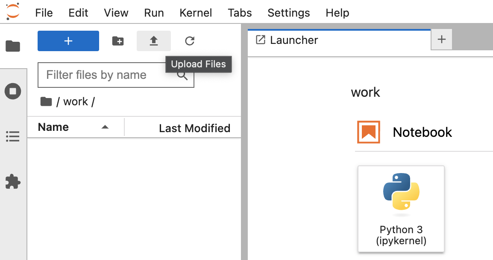
    
    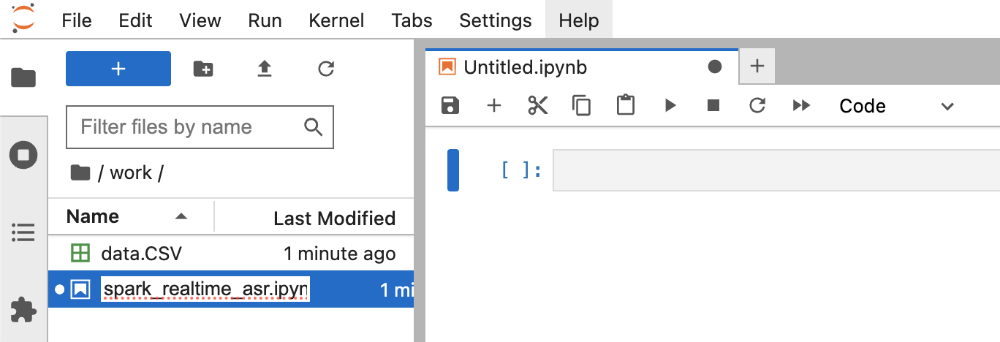

5. In the `stream_data_pipeline_3_spark.ipynb` empty cell, install findpark.

    ```
    !pip3 install findspark
    ```

6. In the `stream_data_pipeline_3_spark.ipynb` new empty cell, import and initialise findspark. If there is no error that means it is executed correctly.

    ```
    import findspark
    findspark.init()
    ```

7. In the `stream_data_pipeline_3_spark.ipynb` new empty cell, enter the the following codes to test the installed spark and jupyter. The codes below create a Spark Application through import and create a Spark session, a context and test the connection to Spark. The code below does the following:

    - SparkSession - the primary entry point for programming Spark with the Dataset and DataFrame API in PySpark.\
    .builder - initiates the building process\
    .master("local") - specifies the Spark master URL, here indicating local execution.\
    .getOrCreate() - returns an existing SparkSession if one is active, otherwise it creates a new one.

    - SparkContext - represents the connection to a Spark cluster and serves as the entry point to Spark's core functionalities. It is the foundational component for building and running Spark applications, particularly those based on Resilient Distributed Datasets (RDDs).

    - spark.range(5).show()\
    spark.range(5) - This creates a PySpark DataFrame with a single column named id. This column contains a sequence of numbers starting from 0 and going up to (but not including) 5. Therefore, the id column will contain the values 0, 1, 2, 3, and 4. This is analogous to Python's built-in range() function.\
    .show() - This method is then called on the generated DataFrame. Its purpose is to display the contents of the DataFrame to the console in a human-readable, tabular format.

    In modern Spark versions (2.0 and later), SparkSession is the preferred entry point, which unifies SparkContext, SQLContext, and HiveContext, providing a more comprehensive API for interacting with Spark, including Spark SQL and DataFrame/Dataset APIs. However, SparkContext remains accessible through SparkSession (e.g., spark.sparkContext) for RDD-based operations when needed.

    ```python
    # import SparkSession
    from pyspark.sql import SparkSession

    # Create SparkApplication
    spark = SparkSession\
                .builder\
                .master("local")\
                .getOrCreate()
    sc = spark.sparkContext

    # Test PySpark
    spark.range(5).show()
    ```

8. In the `stream_data_pipeline_3_spark.ipynb` new empty cell, execute `spark` will show the version of spark, app name, etc.

    ```python
    spark
    ```

9. In the `stream_data_pipeline_3_spark.ipynb` new empty cell, enter the the following codes for parallel processing in spark. The code below does the following:

    - appName('Local-Sum100') - Sets the name of the Spark application to 'Local-Sum100'.
    - rdd = sc.parallelize(range(100 + 1)): creates a Resilient Distributed Dataset (RDD) named rdd
    - range(100 + 1): Generates a sequence of numbers from 0 to 100 (inclusive). This represents the first 101 whole numbers (0 to 100).
    - sc.parallelize(): Distributes the collection of numbers across the Spark cluster (in this case, locally) to create an RDD, enabling parallel processing.
    - rdd.sum(): This performs an action on the RDD to calculate the sum of all its elements. The sum() action triggers the computation across the distributed partitions of the RDD and returns the final sum to the driver program.


    ```python
    from pyspark.sql import SparkSession

    # Spark session & context
    spark = SparkSession.builder.master("local").appName('Local-Sum100').getOrCreate()
    sc = spark.sparkContext

    # Sum of the first 100 whole numbers
    rdd = sc.parallelize(range(100 + 1))
    rdd.sum()
    ```

10. Access Spark Web UI. Access link:

    - In the EC2 instance, enter ```docker ps -a```. Identify the port for dev_jupyter_pyspark. 

        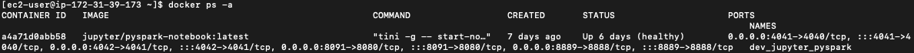

    - Check EC2 Security Groups Inbound rules to ensure port 4041 is configured correctly. If NOT already there, access the server from browser, in the AWS Console, you will need to access EC2 > Security Groups > Edit inbound rules > Save rules 
        
        ```
        Type: Custom TCP
        Port Range: 4041
        Source: Custom
        0.0.0.0/0
        ```

        ```bash
        docker restart dev_jupyter_pyspark
        ```

    - In a local machine, go to browser with link ```http://<ip_address>:4041```.

        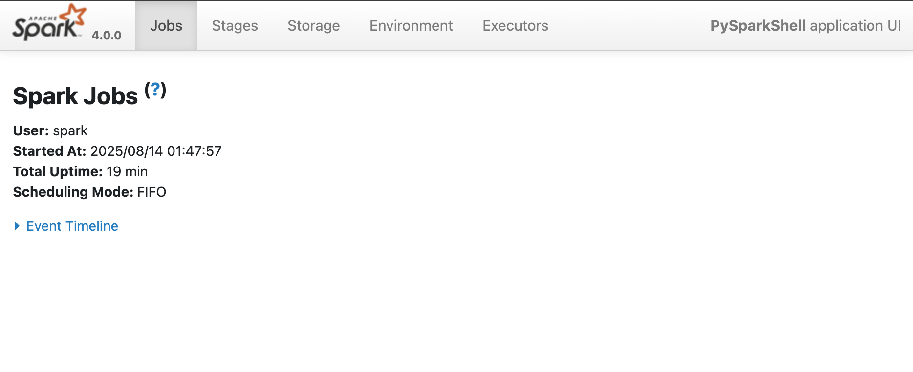

    - In the browser, expand the Event Timeline. You will observe the time of events triggered.

        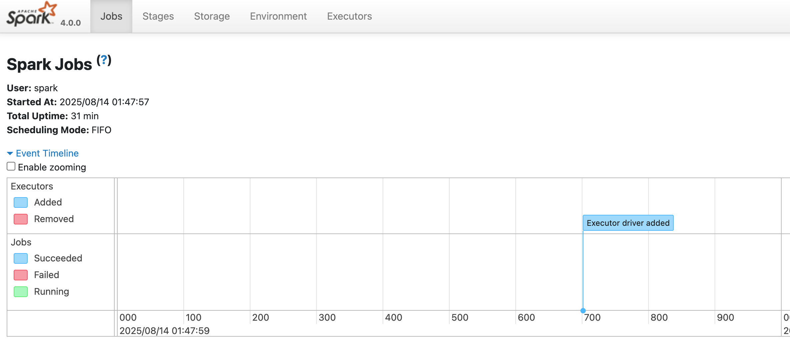

    - Access the cluster services from your browser:

        JupyterLab: http://<ip_address>:8889\
        Spark jobs UI: http://<ip_address>:4041

    - This blog shows more detailed description of Apache Spark Web UI. https://medium.com/@suffyan.asad1/beginners-guide-to-spark-ui-how-to-monitor-and-analyze-spark-jobs-b2ada58a85f7 

11. In the `stream_data_pipeline_3_spark.ipynb` new empty cell, upload the generated data from lab8. Enter the the following codes to read file as a dataframe. The code below does the following:

    - master('spark://pop-os.localdomain:7077'): Specifies that Spark should connect to a standalone Spark cluster running on pop-os.localdomain at port 7077.
    - appName('ReadingFileToDataFrame'): Sets the name of the Spark application, which will be visible in the Spark web UI. 
    -  getOrCreate(): Returns an existing SparkSession if one is already active, otherwise creates a new one.
    - spark.read.csv(): This line reads the carpark_system.csv file into a Spark DataFrame named df. By default, Spark's read.csv() method:
        - Assumes no header row, treating the first row as data.
        - Infers all column types as StringType (unless inferSchema is set to True).
        - Assigns default column names like _c0, _c1, etc.
    - df.show(5): This command prints the first five rows of the df DataFrame to the console.
    - df.printSchema(): This command displays the schema (column names and their data types) of the df DataFrame to the console. 
    - type(df): will confirm you are using Spark DataFrame pyspark.sql.dataframe.DataFrame.


    ```python
    spark = SparkSession.builder.master('spark://pop-os.localdomain:7077').appName('ReadingFileToDataFrame').getOrCreate()
    df = spark.read.csv('carpark_system.csv', header=True, inferSchema=True)
    df.show(5)
    df.printSchema()
    type(df) 

    ```

12. In the `stream_data_pipeline_3_spark.ipynb` new empty cell, you can write standard SQL to query the Spark table. 
    - df.createOrReplaceTempView('carpark_system'): creats a table in the default database for further inspection, you use the createOrReplaceTempView method. You can then write query statements


    ```python
    df.createOrReplaceTempView('carpark_system')

    statement = "select * from carpark_system limit 10"

    results = spark.sql(statement)
    results.show()
    ```

13. In the `stream_data_pipeline_3_spark.ipynb` new empty cell, you can also convert to Pandas DataFrame using ```toPandas``` function.


    ```python
    statement = "select * from carpark_system limit 10"

    results = spark.sql(statement)
    results10_df = results.toPandas()
    results10_df
    ```

14. Lazy Evaluation - Allows Spark to calculate your entire data flow (or transformations on data), not excuting it immediately when they are defined. Spark builds an execution plan, known as Directed Acyclic Graph (DAG), representing the sequence of operations. The actual computation is deferred until an action is triggers. Transformation functions are like ```map```, ```filter```, ```select```, ```join```, etc. Action functions are like ```collect```, ```count```, ```show```, ```write```, etc. This method executes tasks efficiently. reference: https://medium.com/@john_tringham/spark-concepts-simplified-lazy-evaluation-d398891e0568

    In the `stream_data_pipeline_3_spark.ipynb` new empty cell, enter:


    ```python
    # Transformation
    # Spark will not execute this set of codes because these are Transformation functions. 
    # No output will be processed until you complete writing your entire code and then it 
    # generates the proper plan based on the code you have written.

    filter_Park2 = df.LocationID == "Park2"
    results_Park2 = df.filter(filter_Park2)
    ```


    ```python
    # Action
    # To actually execute the transformation block, we have something called Actions function. 
    # Run the action and spark will run the entire transformation block and give us the final output.

    results_Park2.show()
    ```

15. In the `stream_data_pipeline_3_spark.ipynb` new empty cell, copy-paste and run the codes below. 

    <b>Screen capture the pages shown in http://<ip_address>:4041 \
    (Jobs, Stages, Storage, Environment, Executors and SQL/DataFrame).</b>

    The code below does the following:

    - Runs a CPU-intensive math workload and returns the execution time.
    - Process math across the defined partitions
    - Workload settings (15,000,000 math operations distributed across 60 tasks)
    - Running WITHOUT Cluster (Local Single-Thread)

    ```python
    from pyspark.sql import SparkSession
    from random import random
    from operator import add
    import time

    def run_workload(spark_session, total_samples: int, partitions: int) -> float:
        """Runs a CPU-intensive math workload and returns the execution time."""
        def calculate_pi(_: int) -> int:
            x = random() * 2 - 1
            y = random() * 2 - 1
            return 1 if x ** 2 + y ** 2 <= 1 else 0

        start_time = time.time()
        
        # Force Spark to process the math across the defined partitions
        count = spark_session.sparkContext.parallelize(range(1, total_samples + 1), partitions) \
                            .map(calculate_pi) \
                            .reduce(add)
        
        end_time = time.time()
        return end_time - start_time

    if __name__ == "__main__":
        # Workload settings (15,000,000 math operations distributed across 60 tasks)
        SAMPLES = 100000000 #15000000
        PARTITIONS = 64 #60

        print("=" * 60)
        print(f"STARTING BENCHMARK: Processing {SAMPLES:,} records")
        print("=" * 60)

        # -------------------------------------------------------------------------
        # TEST 1: WITHOUT CLUSTER (Pure Local Mode)
        # -------------------------------------------------------------------------
        print("\n>>> [1/2] Running WITHOUT Cluster (Local Single-Thread)...")
        local_spark = SparkSession.builder \
            .master("local[1]") \
            .appName("Benchmark-Without-Cluster") \
            .getOrCreate()
        
        time_without_cluster = run_workload(local_spark, SAMPLES, PARTITIONS)
        print(f"Finished. Time: {time_without_cluster:.2f} seconds")

    ```

    For more detail, see: https://spark.apache.org/docs/latest/sql-getting-started.html \
    Watch this video for additional context: https://www.youtube.com/watch?v=v_uodKAywXA

    - After screen capture you can stop the process. 
        ```bash 
        local_spark.stop()
        ```

16. What is Apache Spark? What motivated its creation?

17. What makes Apache Spark more powerful than Hadoop MapReduce?

# 2. Spark with clusters

In this section, we will refer to an online resource https://github.com/cluster-apps-on-docker/spark-standalone-cluster-on-docker to illustrate the spark with standalone cluster on docker. 

1. SSH into the EC2 instance.

    ```bash
    ssh -i "MyKeyPair.pem" ec2-user@<ip_address>
    ```

2. Stop the docker containers `dev_pyspark` and `dev_jupyter_pyspark` first. Because they might be using the same ports and cause conflicts.

    ```bash
    docker stop dev_pyspark dev_jupyter_pyspark
    ```

3. Go to dev_spark folder and download the docker-compose.yml file.

    ```bash
    cd ~/dev_spark
    curl -LO https://raw.githubusercontent.com/cluster-apps-on-docker/spark-standalone-cluster-on-docker/master/assets/docker-compose.yml
    ```
    - edit the docker-compose.yml file for each worker from:

        ```bash
        SPARK_WORKER_CORES=1
        SPARK_WORKER_MEMORY=512m
        ```
        
        Please change to:

        ```bash
        SPARK_WORKER_CORES=3
        SPARK_WORKER_MEMORY=4g
        ```

4. The default versions are documented here:
    https://github.com/cluster-apps-on-docker/spark-standalone-cluster-on-docker?tab=readme-ov-file#tech-stack

5. In the EC2 instance, start the cluster.

    ```bash
    docker-compose up
    ```

    - Press Ctrl+C to stop the setup.
    - Then start the services:

        ```bash
        docker start jupyterlab spark-master spark-worker-1 spark-worker-2
        ```

    - Verify the containers and port mappings:

        ```bash
        docker ps -a
        ```

    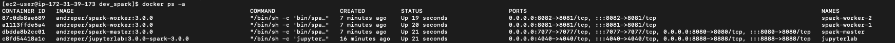

6. Review the cluster architecture:
    https://www.kdnuggets.com/2020/07/apache-spark-cluster-docker.html

    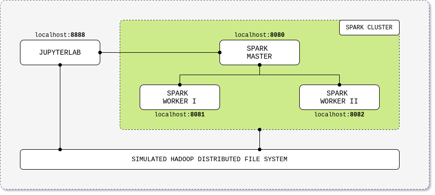

7. Access the cluster services from your browser:

    - JupyterLab: `http://<ip_address>:8888`
    - Spark jobs UI: `http://<ip_address>:4040`
    - Spark Master: `http://<ip_address>:8080`
    - Spark Worker 1: `http://<ip_address>:8081`
    - Spark Worker 2: `http://<ip_address>:8082`

    Check if the ports are already in the EC2 instance security rules. If NOT there, add inbound EC2 security rules for the required ports:

    ```text
    Type: Custom TCP
    Port Range: <port number>
    Source: Anywhere-IPv4
    ```

    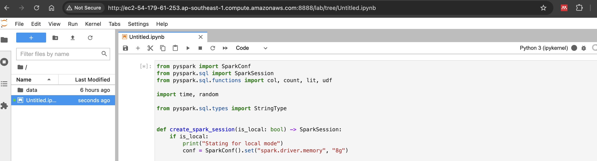

    Observe Spark jobs in the UI http://<ip_address>:4040. You can only see the the events in the timeline after executing the notebook process. This process will take some time to complete all the tasks.:

    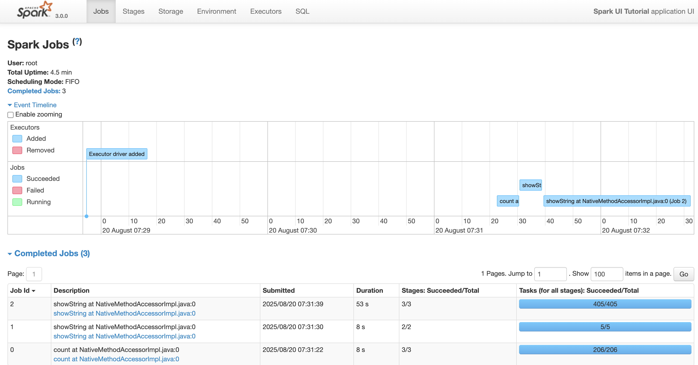
        
    If you click on the job ```showString at NativeMethodAccessorImpl.java:0 (Job 2)``` to view the details.
    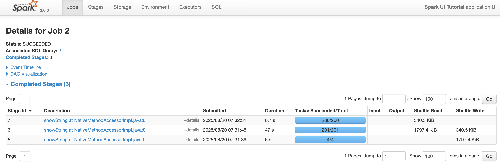

    If you click on DAG, you will see the DAG visualization of the data flow.
    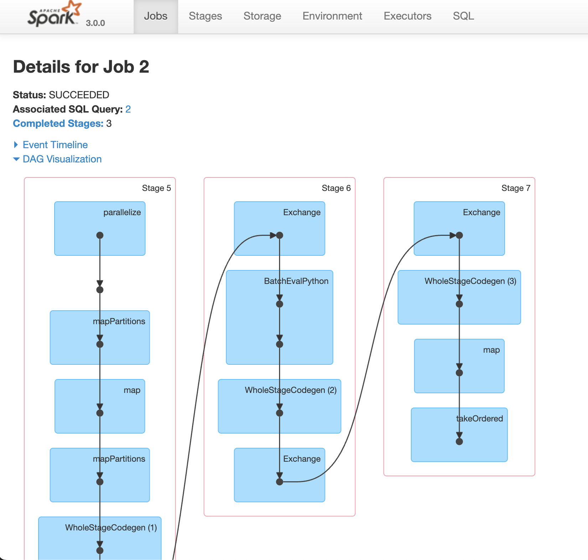

    Spark Master: http:<ip_address>:8080
    The master node processes the input and distributes the computing workload to worker nodes, sending back the results to the IDE.
    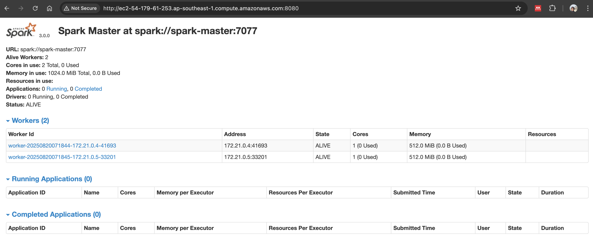

    Spark Worker 1: http:<ip_address>:8081
    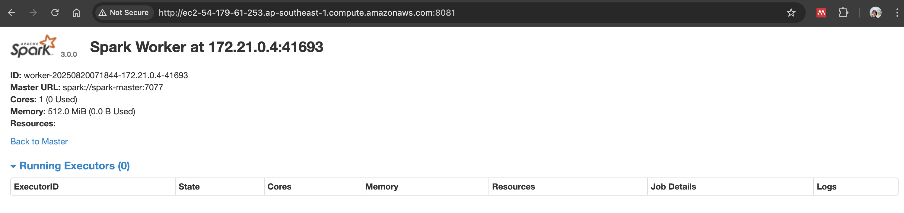

    Spark Worker 2: http:<ip_address>:8082
    

8. In the jupyterlab, create a new jupyter notebook, copy-paste and run the same codes below. <b>Screen capture the pages shown in http://<ip_address>:4040 (Jobs, Stages, Storage, Environment, Executors and SQL/DataFrame).</b>

    The code below does the following:

    - Runs a CPU-intensive math workload and returns the execution time.
    - Process math across the defined partitions
    - Workload settings (15,000,000 math operations distributed across 60 tasks)
    - Running WITHOUT Cluster (Local Single-Thread)
    - Running WITH Cluster (Connecting to Docker Master)
    - Compare results 

    ```python
    from pyspark.sql import SparkSession
    from random import random
    from operator import add
    import time

    def run_workload(spark_session, total_samples: int, partitions: int) -> float:
        """Runs a CPU-intensive math workload and returns the execution time."""
        def calculate_pi(_: int) -> int:
            x = random() * 2 - 1
            y = random() * 2 - 1
            return 1 if x ** 2 + y ** 2 <= 1 else 0

        start_time = time.time()
        
        # Force Spark to process the math across the defined partitions
        count = spark_session.sparkContext.parallelize(range(1, total_samples + 1), partitions) \
                            .map(calculate_pi) \
                            .reduce(add)
        
        end_time = time.time()
        return end_time - start_time

    if __name__ == "__main__":
        # Workload settings (15,000,000 math operations distributed across 60 tasks)
        SAMPLES = 100000000 #15000000
        PARTITIONS = 64 #60

        print("=" * 60)
        print(f"STARTING BENCHMARK: Processing {SAMPLES:,} records")
        print("=" * 60)

        # -------------------------------------------------------------------------
        # TEST 1: WITHOUT CLUSTER (Pure Local Mode)
        # -------------------------------------------------------------------------
        print("\n>>> [1/2] Running WITHOUT Cluster (Local Single-Thread)...")
        local_spark = SparkSession.builder \
            .master("local[1]") \
            .appName("Benchmark-Without-Cluster") \
            .getOrCreate()
        
        time_without_cluster = run_workload(local_spark, SAMPLES, PARTITIONS)
        local_spark.stop()
        print(f"Finished. Time: {time_without_cluster:.2f} seconds")

        # -------------------------------------------------------------------------
        # TEST 2: WITH CLUSTER (Docker Standalone Cluster)
        # -------------------------------------------------------------------------
        print("\n>>> [2/2] Running WITH Cluster (Connecting to Docker Master)...")
        # This explicitly connects to your Docker container master URL # .master("spark://localhost:7077") \
        cluster_spark = SparkSession.builder \
            .master("spark://spark-master:7077") \
            .appName("Benchmark-With-Cluster") \
            .getOrCreate()
        
        time_with_cluster = run_workload(cluster_spark, SAMPLES, PARTITIONS)
        # cluster_spark.stop()
        print(f"Finished. Time: {time_with_cluster:.2f} seconds")

        # -------------------------------------------------------------------------
        # FINAL COMPARISON REPORT
        # -------------------------------------------------------------------------
        print("\n" + "=" * 60)
        print("BENCHMARK PERFORMANCE RESULTS")
        print("=" * 60)
        print(f"Without Cluster (Local Mode):  {time_without_cluster:.4f} seconds")
        print(f"With Cluster (Docker Mode):    {time_with_cluster:.4f} seconds")
        print("-" * 60)
        
        if time_without_cluster < time_with_cluster:
            slowdown = (time_with_cluster - time_without_cluster) / time_without_cluster * 100
            print(f"RESULT: Without Cluster is {slowdown:.1f}% FASTER!")
            print("REASON: Bypassing Docker network & serialization overhead wins on a single machine.")
        else:
            speedup = (time_without_cluster - time_with_cluster) / time_without_cluster * 100
            print(f"RESULT: Cluster is {speedup:.1f}% FASTER!")
            print("REASON: The processing scale bypassed Docker's structural overhead.")
        print("=" * 60)

    ```

10. Does clustering always perform better than without cluster? Comparing the two approaches (no cluster and with cluster), why do you think we need a cluster setup?

<!-- 10. Assignment (Choose one to complete): 

    - Proof and justify the need for a spark cluster setup.
    - Comsume audio data in spark from kafka.
    - In your own words, what do you think are the functions, strength of 
        - airflow
        - kafka 
        - spark
        - postgresql
        - elasticsearch
    - In many real-world applications, the companies combined using kafka and spark. Research on the reason and justify why they need kafka and spark together. -->


# Conclusion

- You have successfully setup spark without cluster and spark with cluster. 
- Understand the strength of using Apache Spark.
- Compared the performance betwen Apache Spark implemented without cluster and spark with cluster. 
- Through this lab you are enabled to design and implement your own number of Apache Spark workers (sometimes called Executers) with Apache Spark masters (sometimes called Drivers).

# Submissions by Wed 9pm (4 Nov)

Submit your notebook as a PDF. Save your notebook as an HTML file, open it in a browser, and print it as a PDF. Include in your submission:

    Section 1.2 Questions 15, 16, 17
    
    Section 2 Question 8, 9


