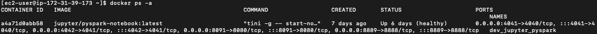

# Lab 11 Stream Data Pipeline III - Spark

Install and using Apache Spark in docker on AWS EC2 instance.
- Use the carpark_system.csv created in Lab8

Create Apache Spark without cluster, with cluster and compare the difference.

Create a new jupyter notebook file "stream_data_pipeline_3_spark.ipynb".


```python
import os
home_directory = os.path.expanduser("~")
os.chdir(home_directory+'/Documents/projects/ee3801')
```

# 1. Spark without Clusters

# 1.1 Install Spark

1. SSH into server.

    ```ssh -i "MyKeyPair.pem" ec2-user@<ip_address>```

2. Go to the directory and create the following directories.

    ```mkdir dev_spark```

    ```cd ~/dev_spark```

    ```mkdir work-dir```

2. Pull docker image and run docker container. 

    ```docker pull spark```

    ```docker run --name dev_pyspark -it -v ~/dev_spark/work-dir:/opt/spark/work-dir -p 8888:8888 -p 8090:8080 -p 4040:4040 spark:latest /opt/spark/bin/pyspark```

    ```exit()```

3. Pull docker image and run docker container. 

    ```docker pull jupyter/pyspark-notebook```

    ```docker run --name dev_jupyter_pyspark -d -v ~/dev_spark/work-dir:/home/jovyan/work -p 8889:8888 -p 8091:8080 -p 4041:4040 -p 4042:4041 jupyter/pyspark-notebook:latest```

4. To access the jupyter spark notebook from browser, you will need to access EC2 > Security Groups > Edit inbound rules > Add rule > Save rules
    
    ```
    Type: Custom TCP
    Port Range: 8889
    Source: Anywhere-IPv4
    ```

# 1.2 Introduction to Spark

1. Access jupyter spark notebook. Go to docker container dashboard dev_jupyter_pyspark's ```Logs```. 

    ```docker logs dev_jupyter_pyspark```

    Copy the link ```http://127.0.0.1:8889/lab?token=************```.

    Paste in the browser and replace ```127.0.0.1``` with the AWS EC2 instance public ip address <ip_address>.

    e.g. ```http://ec2-xxx-xxx-xxx-xx.ap-southeast-1.compute.amazonaws.com:8889/lab?token==************.```

2. Access the work folder.

3. Create a jupyter notebook file using Python3 (ipykernel) in Notebook. 

    

4. Upload data.CSV to jupyter spark. Rename your Untitled.ipynb file as ```stream_data_pipeline_3_spark.ipynb```.

    
    
    

5. Install findpark.

    ```!pip3 install findspark```

6. Import and initialise findspark. If there is no error that means it is executed correctly.

    ```import findspark```

    ```findspark.init()```

7. Enter the the following codes to test the installed spark and jupyter. The codes below create a Spark Application through import and create a Spark session, a context and test the connection to Spark.

    - SparkSession - the primary entry point for programming Spark with the Dataset and DataFrame API in PySpark.\
    .builder - initiates the building process\
    .master("local") - specifies the Spark master URL, here indicating local execution.\
    .getOrCreate() - returns an existing SparkSession if one is active, otherwise it creates a new one.

    - SparkContext - represents the connection to a Spark cluster and serves as the entry point to Spark's core functionalities. It is the foundational component for building and running Spark applications, particularly those based on Resilient Distributed Datasets (RDDs).

    - spark.range(5).show()\
    spark.range(5) - This creates a PySpark DataFrame with a single column named id. This column contains a sequence of numbers starting from 0 and going up to (but not including) 5. Therefore, the id column will contain the values 0, 1, 2, 3, and 4. This is analogous to Python's built-in range() function.\
    .show() - This method is then called on the generated DataFrame. Its purpose is to display the contents of the DataFrame to the console in a human-readable, tabular format.

    In modern Spark versions (2.0 and later), SparkSession is the preferred entry point, which unifies SparkContext, SQLContext, and HiveContext, providing a more comprehensive API for interacting with Spark, including Spark SQL and DataFrame/Dataset APIs. However, SparkContext remains accessible through SparkSession (e.g., spark.sparkContext) for RDD-based operations when needed.

    ```python
    # import SparkSession
    from pyspark.sql import SparkSession

    # Create SparkApplication
    spark = SparkSession\
                .builder\
                .master("local")\
                .getOrCreate()
    sc = spark.sparkContext

    # Test PySpark
    spark.range(5).show()
    ```

8. Execute ```spark``` will show the version of spark, app name, etc.

    ```python
    spark
    ```

9. Enter the the following codes for parallel processing in spark.

    - appName('Local-Sum100') - Sets the name of the Spark application to 'Local-Sum100'.
    - rdd = sc.parallelize(range(100 + 1)): creates a Resilient Distributed Dataset (RDD) named rdd\
    - range(100 + 1): Generates a sequence of numbers from 0 to 100 (inclusive). This represents the first 101 whole numbers (0 to 100).\
    - sc.parallelize(): Distributes the collection of numbers across the Spark cluster (in this case, locally) to create an RDD, enabling parallel processing.
    - rdd.sum(): This performs an action on the RDD to calculate the sum of all its elements. The sum() action triggers the computation across the distributed partitions of the RDD and returns the final sum to the driver program.


    ```python
    from pyspark.sql import SparkSession

    # Spark session & context
    spark = SparkSession.builder.master("local").appName('Local-Sum100').getOrCreate()
    sc = spark.sparkContext

    # Sum of the first 100 whole numbers
    rdd = sc.parallelize(range(100 + 1))
    rdd.sum()
    ```

10. Access Spark Web UI. Access link:

    - At the server, enter ```docker ps -a```. Identify the port for dev_jupyter_pyspark. 

        

    - To access the server from browser, you will need to access EC2 > Security Groups > Edit inbound rules > Add rule > Save rules
        
        ```
        Type: Custom TCP
        Port Range: 4041
        Source: Anywhere-IPv4
        ```

        ```docker start dev_jupyter_pyspark```

    - Go to browser with link ```http://<ip_address>:4041```.

        

    - Expand the Event Timeline. You will observe the time of events triggered.

        

    - This blog shows more detailed description of Apache Spark Web UI. https://medium.com/@suffyan.asad1/beginners-guide-to-spark-ui-how-to-monitor-and-analyze-spark-jobs-b2ada58a85f7 

11. Upload the generated data from lab8. Enter the the following codes to read file as a dataframe.

    - master('spark://pop-os.localdomain:7077'): Specifies that Spark should connect to a standalone Spark cluster running on pop-os.localdomain at port 7077.
    - appName('ReadingFileToDataFrame'): Sets the name of the Spark application, which will be visible in the Spark web UI. 
    -  getOrCreate(): Returns an existing SparkSession if one is already active, otherwise creates a new one.
    - spark.read.csv(): This line reads the carpark_system.csv file into a Spark DataFrame named df. By default, Spark's read.csv() method:
        - Assumes no header row, treating the first row as data.
        - Infers all column types as StringType (unless inferSchema is set to True).
        - Assigns default column names like _c0, _c1, etc.
    - df.show(5): This command prints the first five rows of the df DataFrame to the console.
    - df.printSchema(): This command displays the schema (column names and their data types) of the df DataFrame to the console. 
    - type(df): will confirm you are using Spark DataFrame pyspark.sql.dataframe.DataFrame.


    ```python
    spark = SparkSession.builder.master('spark://pop-os.localdomain:7077').appName('ReadingFileToDataFrame').getOrCreate()
    df = spark.read.csv('carpark_system.csv', header=True, inferSchema=True)
    df.show(5)
    df.printSchema()
    type(df) 

    ```

12. You can write standard SQL to query the Spark table. 
    - df.createOrReplaceTempView('carpark_system'): creats a table in the default database for further inspection, you use the createOrReplaceTempView method. You can then write query statements


    ```python
    df.createOrReplaceTempView('carpark_system')

    statement = "select * from carpark_system limit 10"

    results = spark.sql(statement)
    results.show()
    ```

13. You can also convert to Pandas DataFrame using ```toPandas``` function.


    ```python
    statement = "select * from carpark_system limit 10"

    results = spark.sql(statement)
    results10_df = results.toPandas()
    results10_df
    ```

14. Lazy Evaluation - Allows Spark to calculate your entire data flow (or transformations on data), not excuting it immediately when they are defined. Spark builds an execution plan, known as Directed Acyclic Graph (DAG), representing the sequence of operations. The actual computation is deferred until an action is triggers. Transformation functions are like ```map```, ```filter```, ```select```, ```join```, etc. Action functions are like ```collect```, ```count```, ```show```, ```write```, etc. This method executes tasks efficiently. reference: https://medium.com/@john_tringham/spark-concepts-simplified-lazy-evaluation-d398891e0568


    ```python
    # Transformation
    # Spark will not execute this set of codes because these are Transformation functions. 
    # No output will be processed until you complete writing your entire code and then it 
    # generates the proper plan based on the code you have written.

    filter_Park2 = df.LocationID == "Park2"
    results_Park2 = df.filter(filter_Park2)
    ```


    ```python
    # Action
    # To actually execute the transformation block, we have something called Actions function. 
    # Run the action and spark will run the entire transformation block and give us the final output.

    results_Park2.show()
    ```

15. In the jupyter, copy-paste and run the codes below. <b>Screen capture the pages shown in http://<ip_address>:4041 (Jobs, Stages, Storage, Environment, Executors and SQL/DataFrame).</b>

    The codes below does the following:

    - Creates a DataFrame with two columns, numbers and letters.
    - Each number is mapped to a letter, and the mapping can be changed to produce data skew. Larger the number passed to get_alphabet_skewed function, the bigger the skew on letters x, y and z.
    - A User Defined Function (UDF) that repeats the passed letter 4 times. It can also fail (once in 500,000 times) if a parameter is set to True.

    ```python
    from pyspark import SparkConf
    from pyspark.sql import SparkSession
    from pyspark.sql.functions import col, count, lit, udf

    import time, random

    from pyspark.sql.types import StringType


    def create_spark_session(is_local: bool) -> SparkSession:
        if is_local:
            print("Stating for local mode")
            conf = SparkConf().set("spark.driver.memory", "8g")

            spark_session = SparkSession\
                .builder\
                .master("local[4]")\
                .config(conf=conf)\
                .appName("Spark UI Tutorial") \
                .getOrCreate()

            spark_session.sparkContext.setCheckpointDir("checkpoint")

            return spark_session

        else:
            print("Stating for cluster mode")
            return SparkSession\
                .builder\
                .appName("Spark UI Tutorial")\
                .getOrCreate()


    def get_alphabet_skewed(number: int):
        if number > 25:
            if number % 3 == 0:
                return "x"
            if number % 3 == 1:
                return "y"
            else:
                return "z"
        else:
            return chr(97 + number)


    @udf(returnType=StringType())
    def repeat_letter(letter: str, should_randomly_fail: bool) -> str:
        if should_randomly_fail:
            random_num = random.randint(0, 5000000)
            print(f"Random number: {random_num}")
            if random_num < 1:
                print("Failing ......")
                raise ValueError("Randomly failing")

        print(f"Letter is: {letter}")
        return letter * 4


    def execute_bigger_job(is_local: bool, number_of_records: int):
        spark = create_spark_session(is_local=is_local)

        raw_data = [(i, get_alphabet_skewed(i % 200)) for i in range(0, number_of_records)]
        data_df = spark.createDataFrame(raw_data, ["number", "letter"])\
            .repartition(201)

        print(data_df.count())
        data_df.show(truncate=False)

        data_df\
            .withColumn("repeated_alpha", repeat_letter(col("letter"), lit(False)))\
            .groupBy("repeated_alpha")\
            .agg(count(lit(1)))\
            .sort("repeated_alpha")\
            .show(truncate=False, n=30)


    if __name__ == '__main__':
        execute_bigger_job(is_local=False, number_of_records=10000000)

        # For UI to stick
        time.sleep(1000000) 
    ```

    For detail guide on Spark, refer to this link https://spark.apache.org/docs/latest/sql-getting-started.html. Go through this youtube video to answer the questions below https://www.youtube.com/watch?v=v_uodKAywXA.

16. What do you think is Apache Spark? What motivated the creation of Apache Spark?

17. What makes Apache Spark so powerful compared to Hadoop MapReduce?

# 2. Spark with Clusters

In this section, I will refer to an online resource https://github.com/cluster-apps-on-docker/spark-standalone-cluster-on-docker to illustrate the spark with standalone cluster on docker. 

1. SSH into server.

    ```ssh -i "MyKeyPair.pem" ec2-user@<ip_address>```

2. Stop the docker containers ```dev_pyspark``` and ```dev_jupyter_pyspark``` first. Because they might be using the same ports and cause conflicts.

    ```docker stop dev_pyspark```

    ```docker stop dev_jupyter_pyspark```

3. Go to dev_spark folder and download the docker-compose.yml file.

    ```cd dev_spark```

    ```curl -LO https://raw.githubusercontent.com/cluster-apps-on-docker/spark-standalone-cluster-on-docker/master/docker-compose.yml```

4. The default versions for each tech stack are [here](https://github.com/cluster-apps-on-docker/spark-standalone-cluster-on-docker?tab=readme-ov-file#tech-stack). We will take the default settings for our practice.

5. Start the cluster. 

    ```docker-compose up```

    - CTRL-C to exit the installation.
    - Start up the services. 

        ```docker start jupyterlab spark-master spark-worker-1 spark-worker-2```

    - Check the containers installed and take note of the ports.
        ```docker ps -a```

    

6. This [website](https://www.kdnuggets.com/2020/07/apache-spark-cluster-docker.html) has a detailed explanation on the architecture of the spark clusters setup.

    

        - From the image above, you can access from the browser:

        jupyterlab: http://<ip_address>:8888
        We use JupyterLab Integrated Development Environment (IDE) to write codes and run them.
           To access the server from browser (for ports stated below 8888, 4040, 8080,8081, 8082), you will need to access EC2 > Security Groups > Edit inbound rules > Add rule > Save rules 
        ```
        Type: Custom TCP
        Port Range: <port number>
        Source: Anywhere-IPv4
        ```
    

    Spark jobs: http://<ip_address>:4040
   
    Observe all the spark jobs.
    
        
    If you click on the job ```showString at NativeMethodAccessorImpl.java:0 (Job 2)```.
    
    If you click on DAG, you will see the DAG visualization of the data flow.
    

    Spark Master: http:<ip_address>:8080
    The master node processes the input and distributes the computing workload to worker nodes, sending back the results to the IDE.
    

    Spark Worker 1: http:<ip_address>:8081
    

    Spark Worker 2: http:<ip_address>:8082
    

8. By default, if you observe the docker-compose.yml file. We have set for each worker to use:

    - SPARK_WORKER_CORES=1
    - SPARK_WORKER_MEMORY=512m

9. In the jupyterlab, create a new jupyter notebook, copy-paste and run the same codes below. <b>Screen capture the pages shown in http://<ip_address>:4040 (Jobs, Stages, Storage, Environment, Executors and SQL/DataFrame).</b>

    ```python
    from pyspark import SparkConf
    from pyspark.sql import SparkSession
    from pyspark.sql.functions import col, count, lit, udf

    import time, random

    from pyspark.sql.types import StringType


    def create_spark_session(is_local: bool) -> SparkSession:
        if is_local:
            print("Stating for local mode")
            conf = SparkConf().set("spark.driver.memory", "8g")

            spark_session = SparkSession\
                .builder\
                .master("local[4]")\
                .config(conf=conf)\
                .appName("Spark UI Tutorial") \
                .getOrCreate()

            spark_session.sparkContext.setCheckpointDir("checkpoint")

            return spark_session

        else:
            print("Stating for cluster mode")
            return SparkSession\
                .builder\
                .appName("Spark UI Tutorial")\
                .getOrCreate()


    def get_alphabet_skewed(number: int):
        if number > 25:
            if number % 3 == 0:
                return "x"
            if number % 3 == 1:
                return "y"
            else:
                return "z"
        else:
            return chr(97 + number)


    @udf(returnType=StringType())
    def repeat_letter(letter: str, should_randomly_fail: bool) -> str:
        if should_randomly_fail:
            random_num = random.randint(0, 5000000)
            print(f"Random number: {random_num}")
            if random_num < 1:
                print("Failing ......")
                raise ValueError("Randomly failing")

        print(f"Letter is: {letter}")
        return letter * 4


    def execute_bigger_job(is_local: bool, number_of_records: int):
        spark = create_spark_session(is_local=is_local)

        raw_data = [(i, get_alphabet_skewed(i % 200)) for i in range(0, number_of_records)]
        data_df = spark.createDataFrame(raw_data, ["number", "letter"])\
            .repartition(201)

        print(data_df.count())
        data_df.show(truncate=False)

        data_df\
            .withColumn("repeated_alpha", repeat_letter(col("letter"), lit(False)))\
            .groupBy("repeated_alpha")\
            .agg(count(lit(1)))\
            .sort("repeated_alpha")\
            .show(truncate=False, n=30)


    if __name__ == '__main__':
        execute_bigger_job(is_local=False, number_of_records=10000000)

        # For UI to stick
        time.sleep(1000000) 
    ```

10. Comparing the two approaches (no cluster and with cluster), why do you think we need a cluster setup?

<!-- 10. Assignment (Choose one to complete): 

    - Proof and justify the need for a spark cluster setup.
    - Comsume audio data in spark from kafka.
    - In your own words, what do you think are the functions, strength of 
        - airflow
        - kafka 
        - spark
        - postgresql
        - elasticsearch
    - In many real-world applications, the companies combined using kafka and spark. Research on the reason and justify why they need kafka and spark together. -->


# Conclusion

- You have successfully setup spark without cluster and spark with cluster. 
- Understand the strength of using Apache Spark.
- Compared the performance betwen Apache Spark implemented without cluster and spark with cluster. 
- Through this lab you are enabled to design and implement your own number of Apache Spark workers (sometimes called Executers) with Apache Spark masters (sometimes called Drivers).

# Submissions by Wed 9pm (5 Nov 2025) 

Submit your ipynb as a pdf. Save your ipynb as a html file, open in browser and print as a pdf. Include in your submission:

    Section 1.2 Questions 15, 16, 17
    
    Section 2 Question 8, 9


